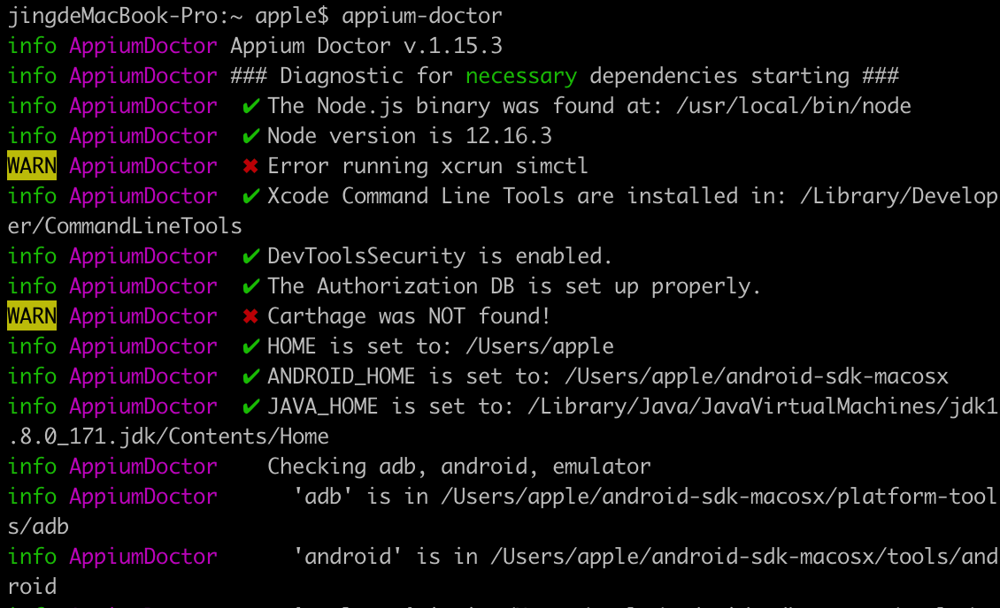
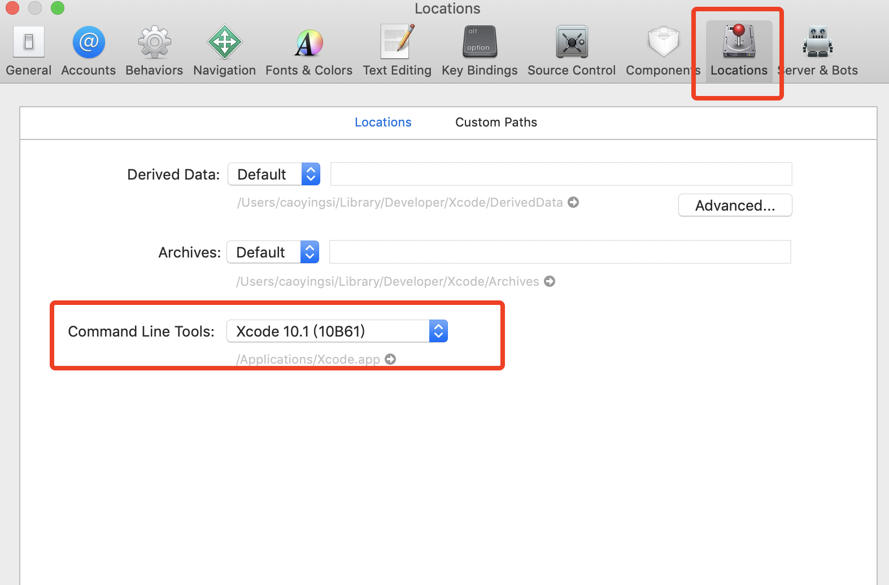

# Appium For Java
## 目前mobile自动化的方案
|iOS|Android|
|---|-------|
|calabash-ios|calabash-android|
|Frank|MonkeyTalk|
|UIAutomation|Robotium|
|ios-driver|UiAutomator|
|KeepltFuncational|selendroid|
|appium|appium|

## 自动化工具选择
|工具名称|被测系统|测试|脚本语言|支持H5|跨应用|稳定性|SDK自带|
|-------|-------|---|-------|------|-----|------|-----|
|MonkeyRunner|Android|功能|Python|支持|否|稳定|是|
|Instrumentation|Android(<4.1)|功能|Java|支持|可以|稳定|否|
|Uiautomator2|Android(>=4.1)|功能|Java|支持|可以|稳定|是|
|Adb-For-Test|Android(<4.1)|功能|Java/Python|支持|可以|稳定|否|
|Monkey|Android|稳定|Java|否|否|稳定|是|
|CTS|Android|兼容|Java|支持|可以|稳定|否|
|Uiautomation|iOS|功能|JS|支持|可以|稳定|xcode自带|
|Calabash|Android、iOS|功能|Ruby|支持|可以|一般|否|
|Appium|Android、iOS|功能|Java/Python/JS/C/C#/Perl/|支持|可以|一般|否|

## Appium介绍
Appium是一个移动端的自动化测试框架，可用于测试原生应用，移动网页应用和混合应用，且是跨平台的。可用于iOS和Android操作系统。
- **原生应用**是指用Android和iOS编写的应用
- **移动网页应用**是指网页应用，类似于iOS中的Safari应用或者Chrome应用或者类似浏览器的应用
- **混合应用**是指一种包裹webview的应用，原生应用网页内容交互性的应用

重要的是Appium是跨平台的。何为跨平台，意思是可以针对不同平台用一套api来编写脚本。

- 跨语言：Java、Python、nodejs等
- 跨平台：
    - Android、iOS
    - Windows、Mac
- 底层多引擎可切换
- 生态丰富，社区强大

## Appium引擎列表
- Android
    - espresso - Espresso Driver（BETA）
    - selendroid - Selendroid Driver（已废弃）
    - uiautomator - UIAutomator Driver（已废弃）
    - uiautomator2【推件】- UIAutomator2 Driver
- iOS
    - uiautomator - UIAutomator Driver（已废弃）
    - xcuitest【推荐】- XCUITest Driver
- mac - Mac Driver（for Mac Desktop apps）
- Windows - Windows Driver（for Windows Desktop apps）

## Appium的设计理念
- webdriver是基于http协议，第一连接会建立一个session会话，并通过post发送一个json告知服务端相关测试信息
- Client/Server设计模式
    - 客户端通过WebDriver json wire协议与服务端通讯
    - 多语言支持
- Server可以放在任何地方
- 服务端NODEJS开发的HTTP服务
- appium使用appium-xcuitest-driver来测试iPhone社备，其中需要安装facebook出的WDA（webdriver agent）来驱动iOS测试

## Appium安装
### appium生态工具
- adb：android的控制工具，用于获取Android的各种数据和控制
- Appium Desktop：内嵌了appium server和inspector的综合工具
- Appium Server：appium核心工具，命令行工具
- Appium client：各种语言的客户端封装库，用于连接appium server
    - python、java、ruby、robotframework-appium
- AppCrawler：自动遍历工具

### 环境安装
- Java 1.8
    - 安装JDK（1.8版本）
        - 官网下载：http://www.oracle.com/technetwork/java/javase/downloads/index.html
        - 安装（一直点下一步->完成，默认路径即可）
        - 环境变量配置(Mac版)
        ```
        jingdeMacBook-Pro:~ apple$ cat ~/.bash_profile
        JAVA_HOME="/Library/Java/JavaVirtualMachines/jdk1.8.0_171.jdk/Contents/Home"
        CLASS_PATH="$JAVA_HOME/lib"
        export PATH="$JAVA_HOME/bin:$PATH"
        export JAVA_HOME
        ```
        - 检查Java环境是否配置好
        - 进入命令行，输入java -version 或 javac -version,输出版本信号即成功
        ```
        ingdeMacBook-Pro:~ apple$ java -version
        java version "1.8.0_171"
        Java(TM) SE Runtime Environment (build 1.8.0_171-b11)
        Java HotSpot(TM) 64-Bit Server VM (build 25.171-b11, mixed mode)
        jingdeMacBook-Pro:~ apple$ javac -version
        javac 1.8.0_171
        ```
- Android sdk
    - 下载sdk
        - Android studio地址：https://developer.android.com/studio/index.html
        - 中文官网下载地址：http://tools.android-studio.org/index.php/sdk
            - 下载后，进入目录下，打开README.txt告诉我们需要执行命令更新sdk
            ```
            jingdeMacBook-Pro:~ apple$ cd android-sdk-macosx/
            jingdeMacBook-Pro:android-sdk-macosx apple$ tools/android update sdk --no-ui
            ```
    - 安装sdk
        - 其实sdk就是个文件夹，下载之后需要手动更新，配上环境变量就可以使用，不需要手动安装
    - 配置android sdk环境变量，如下（Mac）：
    ```
    export ANDROID_HOME=/Users/apple/android-sdk-macosx
    export PATH=$PATH:$ANDROID_HOME/tools
    export PATH=$PATH:$ANDROID_HOME/platform-tools
    ```
    - 检查是否安装成功，命令行adb回车或adb shell然后回车
    ```
    jingdeMacBook-Pro:~ apple$ adb
    Android Debug Bridge version 1.0.41
    Version 29.0.6-6198805
    Installed as /Users/apple/android-sdk-macosx/platform-tools/adb
    
    global options:
     -a         listen on all network interfaces, not just localhost
     -d         use USB device (error if multiple devices connected)
     -e         use TCP/IP device (error if multiple TCP/IP devices available)
     -s SERIAL  use device with given serial (overrides $ANDROID_SERIAL)
     -t ID      use device with given transport id
     -H         name of adb server host [default=localhost]
     -P         port of adb server [default=5037]
     -L SOCKET  listen on given socket for adb server [default=tcp:localhost:5037]
    
    general commands:
     devices [-l]             list connected devices (-l for long output)
     help                     show this help message
     ...
    jingdeMacBook-Pro:~ apple$ adb shell
    * daemon not running; starting now at tcp:5037
    * daemon started successfully
    error: no devices/emulators found
    ```
- Node.js（>=10版本），npm(>=6版本)
- python3
- appium-desktop
    - 安装appium desktop（appium server + appium inspector工具）
        - 下载对应操作系统的安装包：https://github.com/appium/appium-desktop/releases
        - 如果不需要appium inspector，也可以通过npm直接安装appium
            - 官方安装（不推荐）
            ```
            npm install -g appium
            ```
            - 淘宝提供（推荐）
            ```
            npm install -g cnpm --registry.npm.taobao.org
            cnpm install -g appium
            ```
        - 运行
            - appium（不报错说明安装成功）
- Appium python client
    - 安装appium python client
        - 方式一：pip install appium-python-client(推荐)
        - 方式二：下载源码包
            - 下载地址：
                - https://github.com/appium/python-client
                - https://pypi.python.org/pypi/Appium-Python-Client
            - 解压后在命令行中进入python-client-master目录，该目录下包含setup.py文件
            - 执行命令python setup.py install命令安装客户端
- Appium java client
    - 使用地址：https://github.com/appium/java-client

### appium环境安装检测
- 安装appium-doctor检测appium的安装环境
    - cnpm install -g appium-doctor
- 在命令执行appium-doctor

查看有两处红叉的地方，表示环境检测未完成，则需要解决这两处
- Error running xcrun simctl
    - 这个是由于Xcode没有选择版本号导致的，打开Xcode-->Preferences-->Locations-->Command Line Tools 选择版本号就可以了
    
- Carthage was NOT found!
    - 安装Carthage即可
    ```
    brew update
    brew install carthage
    ```

## Android自动化
### android自动化前提依赖
- adb工具
- 模拟器 or 真机
    - 模拟器：网易mumu、genimotion，或者sdk自带模拟器
        - 网易mumu操作
            - 连接：adb connect 127.0.0.1:7555
            - 查看：adb devices
            ```
            【win版】
            adb connect 127.0.0.1:7555
            adb shell
            【mac版】
            adb kill-server && adb server && adb shell
            ```
    - 真机需要root权限
- Appium Desktop：入门学习工具
    - Desktop主要功能
        - UI分析
        - 录制用例
        - 元素查找测试
        - Attach已有session
        - 云测试

### Android常用命令
- adb:Android Debug Bridge
- adb devices:查看设备
- adb kill-server:关闭adb的后台进程
- adb tcpip:让Android脱离USB线的TCP连接方式
- adb connect:连接开启了TCP连接方式的手机
- adb logcat:Android日志查看
- adb bugreport:收集日志数据，用于后续的分析，比如耗电量

### adb shell
- adb shell本身就是一个Linux的shell，可以调用Android内置命令
- adb shell
- adb shell dumpsys
- adb shell pm
- adb shell am
- adb shell ps
- adb shell monkey

### 获取App的信息
- App信息
    - 获取当前界面元素：adb shell dumpsys activity top
    - 获取任务列表：adb shell dumpsys activity activities
- App入口
    - adb logcat | grep -i displayed
    - aapt dump badging mobike.apk | grep launchable-activity
    - apkanalyzer最新版本的sdk中才有
- 启动应用
    - adb shell am start -W -n com.xueqiu.android/.view.WelcomeActivityAlias -S

### 自动化测试常用命令
- adb
- pm
    - 清理指定包的缓存：adb shell pm clear com.xueqiu.android
- am
    - 启动指定的activity：adb shell am start -n com.xueqiu.android/.view.WelcomeActivityAlias -S
- dumpsys
- uiautomator
    - adb shell uiautomator dump
    - adb shell uiautomator runtest ...
- input
    - 模拟事件：adb shell input xxx

#### Android性能统计dumpsys
- 获取所有的dumpsys子命令：dumpsys | grep -i DUMP
- 获取当前activity： adb shell dumpsys activity top
- 获取activities记录，可以获取到appium依赖的原始activity：dumpsys activity activities
- 获取特定包基本信息：adb shell dumpsys package com.xueqiu.android
- 获取系统通知：adb shell dumpsys notification
- 获得内存信息：adb shell dumpsys meminfo com.android.settings
- 获取cpu信息：adb shell dumpsys cpuinfo
- 获取gpu绘制分析：adb shell dumpsys gfxinfo com.android.settings
- 获取短信：adb shell dumpsys activity broadcasts | grep senderName=
